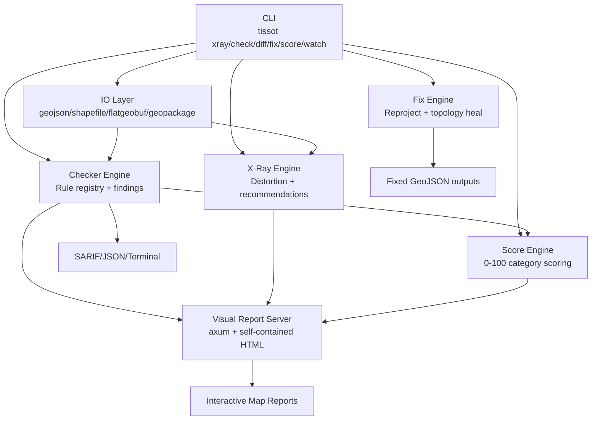

# Tissot Architecture Diagram

The architecture is intentionally visual-first: findings and distortion metrics are spatially rendered for rapid diagnostics, while machine-readable outputs are provided for CI/CD.
