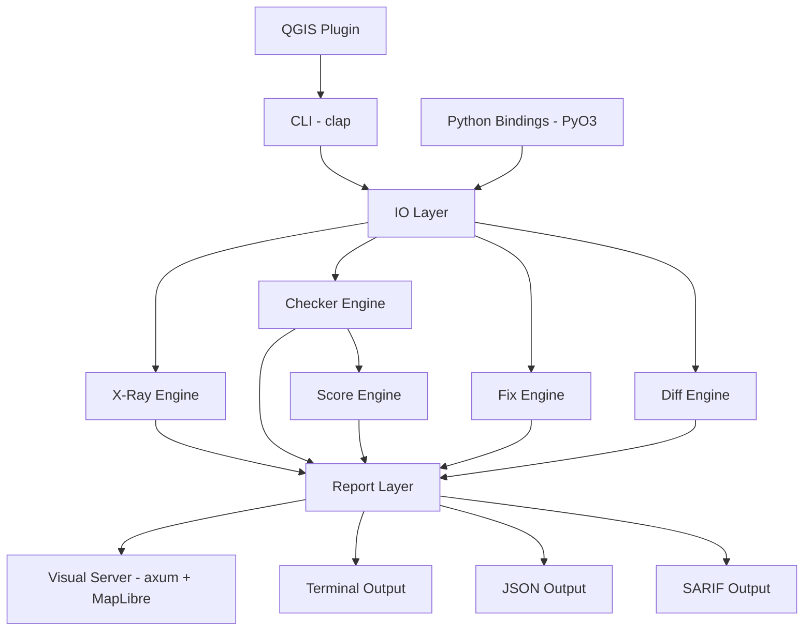
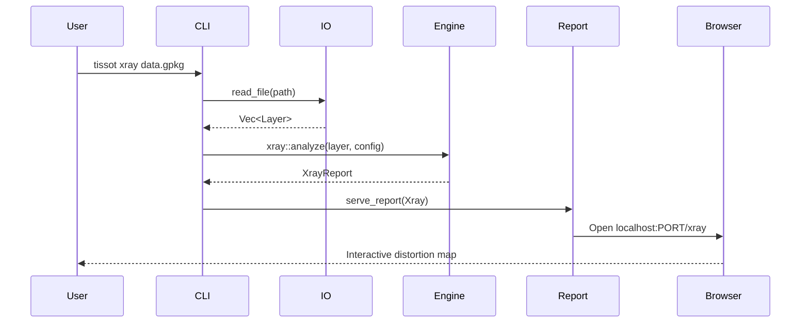

# Architecture

Tissot is a Rust-core geospatial diagnostics engine with Python bindings via PyO3, a CLI interface, and a visual report server.

## System Overview



## Core Subsystems

### 1. X-Ray Engine (`src/xray/`)

The hero feature. Computes per-feature projection distortion using Jacobian matrix analysis.

**Pipeline:**

1. **Sample** — Stratified grid sampling of feature centroids (configurable `max_samples`)
2. **Jacobian** — Compute 2x2 Jacobian matrix at each sample point via `proj` crate
3. **Tissot Parameters** — Extract semimajor axis, semiminor axis, rotation angle from Jacobian SVD
4. **Distortion Metrics** — Area distortion (det J), distance distortion (singular values), shape distortion (axis ratio)
5. **Heatmap** — IDW interpolation of distortion values across feature extents
6. **Ellipses** — Generate GeoJSON polygon ellipses at sample locations
7. **Recommend** — Evaluate CRS candidates (UTM, State Plane, continental), rank by distortion minimization

### 2. Checker Engine (`src/checkers/`)

Rule-based diagnostic system with compile-time discovery via the `inventory` crate.

**Rule Trait:**

```rust
pub trait Rule: Send + Sync {
    fn id(&self) -> &str;
    fn domain(&self) -> Domain;
    fn severity(&self) -> Severity;
    fn description(&self) -> &str;
    fn check(&self, layers: &[Layer], config: &Config, source: &str) -> Vec<Finding>;
    fn can_fix(&self) -> bool { false }
}
```

**Domains:**

| Domain | Rules | Focus |
|--------|-------|-------|
| Data Quality | 9 | Geometry validity, topology, schema |
| Projection | 5 | CRS appropriateness, distortion |
| Cloud Native | 6 | Format optimization, spatial indexing |
| Cartography | TBD | Visual quality, accessibility |

### 3. Fix Engine (`src/fix/`)

Autofix transformations that write corrected data.

- **Reproject** — Transform to target CRS via `proj`, write GeoJSON output
- **Topology** — Snap features to heal gaps, remove null/duplicate geometries
- Output: new file (`_fixed` suffix) or `--in-place`

### 4. Score Engine (`src/score/`)

Aggregates checker findings into a weighted 0-100 quality score.

**Algorithm:**

- Start at 100 per category
- Deduct per severity: Error -15 (cap -60), Warning -5 (cap -30), Info -1 (cap -10)
- Floor at 0 per category
- Weighted average across categories produces overall score
- Letter grade: A (90+), B (80+), C (70+), D (60+), F (<60)

### 5. Visual Report Server (`src/report/visual/`)

Local axum web server serving self-contained HTML reports with MapLibre GL JS.

**Report Types:**

| Route | Content |
|-------|---------|
| `/xray` | Distortion heatmap + Tissot ellipses + CRS recommendations |
| `/findings` | Diagnostic findings plotted on data map |
| `/score` | Score dashboard with gauge charts |
| `/diff` | Before/after slider comparison |
| `/watch` | Live SSE streaming dashboard |

**Constraints:**

- Self-contained HTML (no CDN, works offline)
- Dark theme default
- MapLibre GL JS bundled inline
- Vanilla JS only (no frameworks)

### 6. IO Layer (`src/io/`)

Format readers following a geozero-first strategy (DL-004).

| Format | Crate | Strategy |
|--------|-------|----------|
| GeoJSON | `geojson` + `serde_json` | Pure Rust |
| Shapefile | `shapefile` | Pure Rust |
| FlatGeobuf | `flatgeobuf` | Pure Rust |
| GeoPackage | `geozero` / `gdal` | Pure Rust read, GDAL write (feature-gated) |

## Data Flow



## Technology Stack

| Layer | Technology | Purpose |
|-------|-----------|---------|
| Core | Rust 2024 edition | Performance, safety |
| Geometry | `geo` crate | Spatial primitives |
| CRS | `proj` crate | Coordinate transformations |
| CLI | `clap` 4 | Argument parsing |
| Web | `axum` + `tokio` | Async HTTP server |
| Templates | `askama` | HTML report generation |
| Maps | MapLibre GL JS | Interactive WebGL maps |
| Python | PyO3 + maturin | Python bindings |
| IO | geozero, shapefile, flatgeobuf | Format readers |

## Design Decisions

Key architectural decisions are documented in `ai-dev/decisions/`:

- **DL-002** — Rust core + PyO3 (performance-critical in Rust, Python is API surface)
- **DL-003** — Visual-first output (browser maps default, terminal secondary)
- **DL-004** — Geozero-first IO (pure Rust preferred, GDAL optional)
- **DL-005** — WebAssembly target (core compiles to wasm32 for browser use)
- **DL-006** — WebGPU heatmap (Phase 2, GPU compute for real-time rendering)
